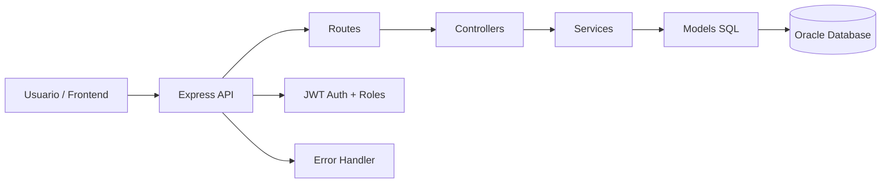
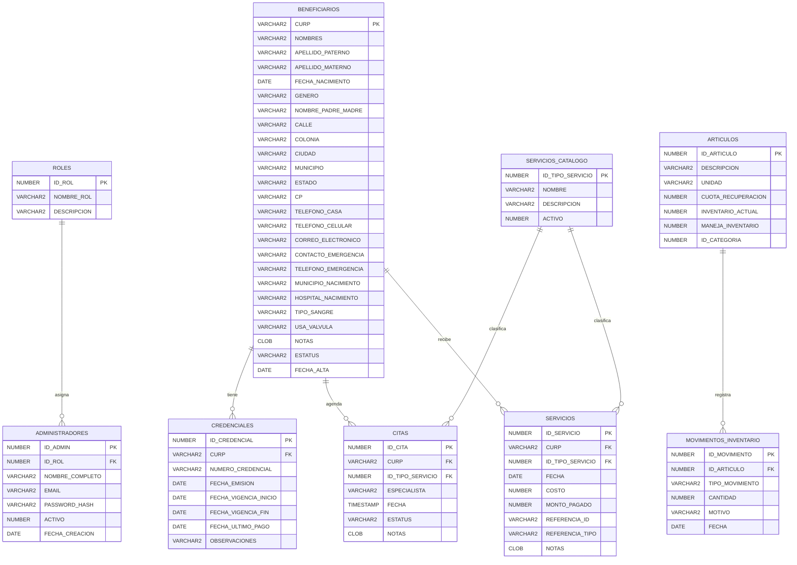

# Documento preliminar — Arquitectura y Base de Datos

## 1) Introducción

El proyecto **EspinaBifida** implementa un backend en Node.js/Express conectado a Oracle para gestionar beneficiarios, membresías, servicios, citas, inventario y control administrativo.

Este documento consolida, de forma preliminar, la base documental solicitada para el proyecto:

- Introducción
- Referencias
- Glosario
- Arquitectura preliminar
- Modelo Entidad–Relación (ER)

Además, el script de base de datos del proyecto se entrega en el archivo:

- `docs/script_bd_proyecto.sql`

---

## 2) Referencias

### Referencias internas del repositorio

1. `README.md`
2. `docs/API_REFERENCE.md`
3. `docs/Beneficiarios Docu Tecnica.md`
4. `docs/Inventario Docu Tecnica.md`
5. `src/config/db.js`
6. `src/app.js`
7. `src/models/*.model.js`
8. `scripts/export-schema-ddl.js`

### Referencias técnicas externas

1. Node.js
2. Express
3. Oracle Database / `node-oracledb`
4. JSON Web Token (JWT)

---

## 3) Glosario

- **Beneficiario:** Persona atendida por la asociación, identificada por CURP.
- **CURP:** Clave única de identidad de beneficiarios; llave primaria de `BENEFICIARIOS`.
- **Membresía / Credencial:** Vigencia administrativa de un beneficiario, almacenada en `CREDENCIALES`.
- **Servicio:** Atención o concepto cobrado a un beneficiario (`SERVICIOS`).
- **Catálogo de servicios:** Tipos de servicio disponibles (`SERVICIOS_CATALOGO`).
- **Cita:** Registro de agenda para atención (`CITAS`).
- **Artículo:** Insumo o producto gestionado por inventario (`ARTICULOS`).
- **Movimiento de inventario:** Entrada o salida de artículos (`MOVIMIENTOS_INVENTARIO`).
- **Administrador:** Usuario interno del sistema (`ADMINISTRADORES`).
- **Rol:** Perfil de permisos para administradores (`ROLES`).
- **Borrado lógico:** Desactivación sin eliminación física (ej. `ESTATUS='Baja'`).

---

## 4) Arquitectura preliminar

El sistema sigue una arquitectura por capas:

- **API REST (Express):** expone endpoints por módulo.
- **Controller:** recibe solicitudes HTTP y forma respuestas.
- **Service:** aplica reglas de negocio y validaciones.
- **Model:** ejecuta SQL directo contra Oracle.
- **Oracle DB:** persistencia transaccional del dominio.

### Vista de componentes (preliminar)



### Módulos funcionales

- Beneficiarios
- Membresías
- Servicios
- Citas
- Artículos
- Inventario / Movimientos
- Administradores
- Roles

---

## 5) Modelo Entidad–Relación (preliminar)



---

## 6) Nota sobre extracción oficial de DDL desde Oracle

Para extraer el DDL completo y oficial directamente de la base Oracle del proyecto, se puede usar el script existente del repositorio:

```bash
npm run export:ddl
```

Esto ejecuta `scripts/export-schema-ddl.js` y genera un archivo SQL con tablas, constraints, secuencias, vistas, triggers, índices y más objetos del esquema.
