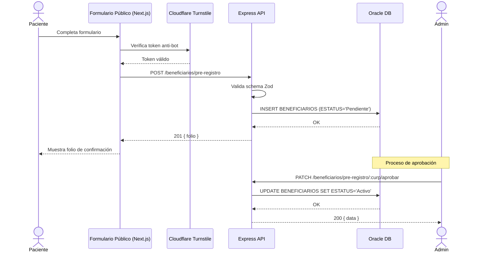
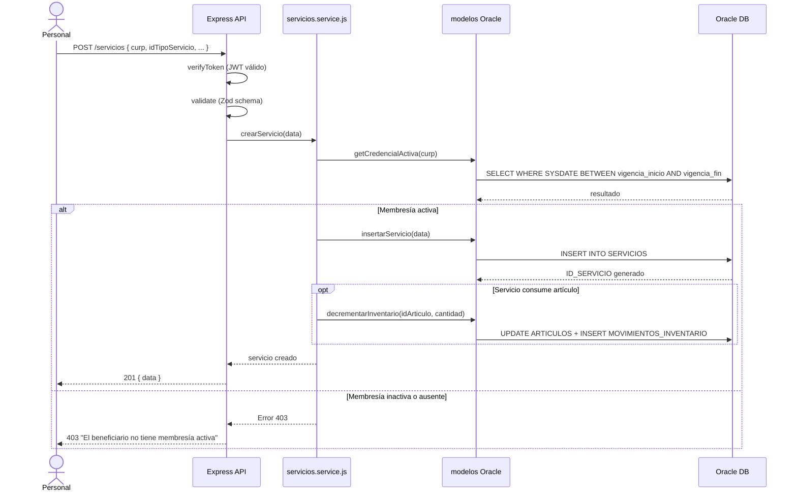
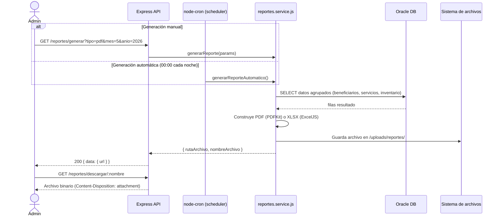
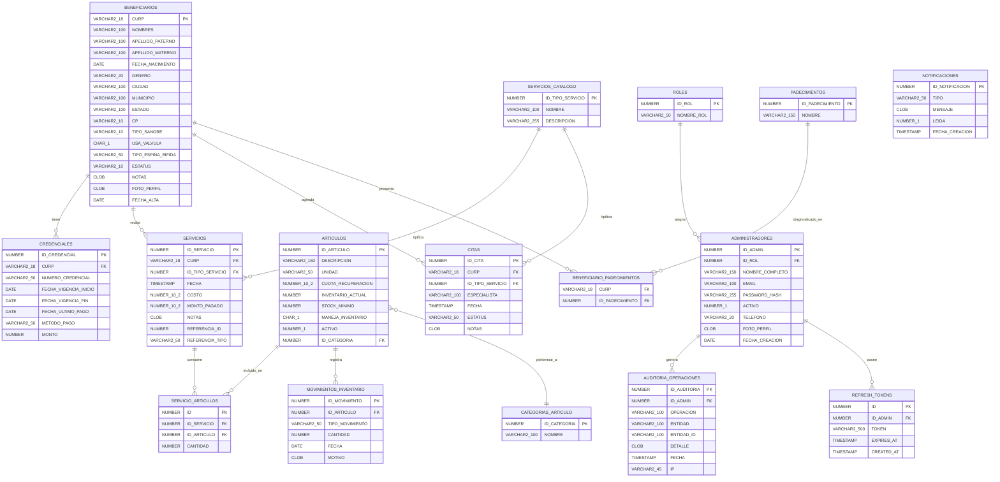

# Documento de Diseño de Software (SDD)
# Sistema de Gestión — Asociación de Espina Bífida de Nuevo León

**Versión:** 1.1  
**Fecha:** 2026-06-01  
**Institución:** Tecnológico de Monterrey  
**Equipo:** AccessCode EB  
**Estado del sistema:** Producción — 9 módulos backend, 11 módulos frontend, 21 migraciones BD

---

## Tabla de Contenido

1. [Introducción](#1-introducción)
   - 1.1 Propósito del documento
   - 1.2 Alcance del sistema
   - 1.3 Definiciones y acrónimos
   - 1.4 Visión general del documento
2. [Referencias](#2-referencias)
3. [Glosario](#3-glosario)
4. [Contenido Detallado](#4-contenido-detallado)
   - 4.1 Identificación de involucrados (stakeholders)
   - 4.2 Preocupaciones de diseño
   - 4.3 Perspectivas de diseño
5. [Estructura de Base de Datos](#5-estructura-de-base-de-datos)
   - 5.1 Modelo Entidad-Relación
   - 5.2 Modelo Relacional
   - 5.3 Convenciones de BD

---

## 1. Introducción

### 1.1 Propósito del documento

Este Documento de Diseño de Software (SDD) describe la arquitectura, el diseño lógico y físico, los modelos de datos y las decisiones técnicas del **Sistema de Gestión de la Asociación de Espina Bífida de Nuevo León**. El documento está dirigido a los equipos de desarrollo, a los asesores académicos del Tecnológico de Monterrey y al personal técnico del socio formador.

El SDD complementa el documento de requisitos (SRS) y sirve como referencia autoritativa para cualquier decisión de implementación, mantenimiento o extensión del sistema.

### 1.2 Alcance del sistema

El sistema reemplaza flujos de trabajo fragmentados en hojas de cálculo Excel para centralizar y automatizar la gestión de:

- **Beneficiarios:** registro, pre-registro público, aprobación/rechazo, historial médico, gestión de estatus.
- **Membresías / Credenciales:** alta, renovación, validación de vigencia, generación de tarjeta CR-80 imprimible.
- **Servicios médicos:** registro de consultas, estudios, medicamentos y comodatos con validación de membresía activa.
- **Inventario:** artículos, movimientos de entrada/salida, alertas de stock mínimo.
- **Citas:** agendado, seguimiento y filtros por fecha y estatus.
- **Reportes:** generación PDF y Excel descargables, reportes automáticos por scheduler.
- **Administradores:** gestión de cuentas, autenticación JWT, cambio y recuperación de contraseña vía SMS OTP.
- **Notificaciones:** alertas automáticas de stock bajo y membresías próximas a vencer o vencidas.
- **Auditoría:** registro de operaciones sensibles para trazabilidad y cumplimiento.

El sistema tiene dos interfaces de usuario:

1. **Panel administrativo interno** — para personal autorizado de la asociación (Administrador y Recepción).
2. **Formulario público de pre-registro** — accesible sin autenticación para pacientes y familiares.

### 1.3 Definiciones y acrónimos

| Acrónimo / Término | Significado |
|---|---|
| SDD | Software Design Document — Documento de Diseño de Software |
| SRS | Software Requirements Specification — Especificación de Requisitos de Software |
| API | Application Programming Interface |
| REST | Representational State Transfer |
| JWT | JSON Web Token |
| RBAC | Role-Based Access Control — Control de Acceso Basado en Roles |
| OTP | One-Time Password — Contraseña de un Solo Uso |
| CURP | Clave Única de Registro de Población (identificador nacional mexicano, 18 caracteres) |
| MVC | Model-View-Controller — patrón arquitectónico |
| ORM | Object-Relational Mapper |
| BD | Base de Datos |
| CI/CD | Continuous Integration / Continuous Deployment |
| E2E | End-to-End (pruebas de extremo a extremo) |
| PK | Primary Key — Llave Primaria |
| FK | Foreign Key — Llave Foránea |
| XLSX | Formato de archivo Excel (Open XML) |
| PDF | Portable Document Format |
| SMS | Short Message Service |

### 1.4 Visión general del documento

El presente documento está organizado en cinco secciones principales:

- **Sección 1** presenta el propósito, alcance y acrónimos del documento.
- **Sección 2** enumera las tecnologías, frameworks y estándares que el sistema utiliza como referencias.
- **Sección 3** define el vocabulario del dominio del negocio.
- **Sección 4** describe en detalle a los involucrados, las preocupaciones de diseño y las cuatro perspectivas arquitectónicas: lógica, de proceso, de desarrollo y física.
- **Sección 5** documenta la estructura completa de la base de datos, incluyendo el modelo entidad-relación, el modelo relacional y las convenciones aplicadas.

---

## 2. Referencias

La siguiente tabla lista los frameworks, librerías y estándares que conforman la base tecnológica del sistema.

| Componente | Tecnología / Librería | Versión | Propósito |
|---|---|---|---|
| **Runtime backend** | Node.js | 20 LTS | Entorno de ejecución JavaScript en servidor |
| **Framework backend** | Express.js | 4.x | Enrutamiento HTTP, middleware y API REST |
| **Framework frontend** | Next.js | 14 (App Router) | Framework React con SSR/SSG, proxy de API |
| **UI Library** | React | 18 | Componentes de interfaz de usuario |
| **Lenguaje frontend** | TypeScript | 5.x | Tipado estático para JavaScript |
| **Base de datos** | Oracle Database | 21c (Autonomous DB) | Motor de base de datos relacional |
| **Driver BD** | `node-oracledb` | 6.x | Conexión Node.js ↔ Oracle |
| **Autenticación** | JWT (`jsonwebtoken`) | 9.x | Tokens de acceso y refresh tokens |
| **Validación** | Zod | 3.x | Validación de esquemas en backend y frontend |
| **Pruebas unitarias** | Jest | 29.x | Suite de pruebas unitarias e integración |
| **Pruebas API** | Supertest | 6.x | Pruebas de endpoints HTTP |
| **Pruebas E2E** | Playwright | 1.x | Automatización de navegador y pruebas E2E |
| **Reporte E2E** | QASE | — | Trazabilidad de casos de prueba |
| **Análisis de calidad** | SonarCloud | — | Análisis estático de código |
| **Componentes UI** | shadcn/ui + Radix UI | — | Componentes accesibles y componibles |
| **Estilos** | Tailwind CSS | 3.x | Framework CSS utilitario |
| **Generación PDF** | PDFKit | — | Generación de reportes y tarjetas CR-80 |
| **Generación Excel** | ExcelJS | — | Generación de reportes XLSX |
| **Scheduler** | `node-cron` | — | Jobs automáticos (reportes nocturnos, notificaciones) |
| **Protección bots** | Cloudflare Turnstile | — | Verificación CAPTCHA en formulario público |
| **SMS OTP** | Twilio | — | Envío de OTP para autenticación de segundo factor |
| **Rate limiting** | `express-rate-limit` | — | Protección contra ataques de fuerza bruta |
| **Seguridad cabeceras** | Helmet.js | — | HTTP security headers |
| **Subida de archivos** | Multer | — | Manejo de multipart/form-data (fotos de perfil) |
| **CI/CD** | GitHub Actions | — | Pipeline de integración y entrega continua |
| **Documentación API** | Swagger / OpenAPI 3.0 | — | 82 endpoints documentados en `/api-docs` |
| **Estándar REST** | RFC 7231 + RFC 6750 | — | Semántica HTTP y Bearer tokens |

---

## 3. Glosario

| Término | Definición |
|---|---|
| **Espina Bífida** | Malformación congénita de la columna vertebral en la que el tubo neural no se cierra completamente durante el desarrollo fetal. Requiere atención médica continua y seguimiento especializado. |
| **CURP** | Clave Única de Registro de Población. Identificador alfanumérico de 18 caracteres asignado a cada ciudadano mexicano por el Registro Nacional de Población. Es la llave primaria de la tabla `BENEFICIARIOS`. |
| **Beneficiario** | Persona con diagnóstico de Espina Bífida (o familiar directo) registrada en el sistema y atendida por la asociación. |
| **Pre-registro** | Solicitud de ingreso al sistema enviada públicamente por un paciente o familiar, antes de ser aprobada o rechazada por el personal administrativo. |
| **Membresía / Credencial** | Registro **anual** (vigencia de 12 meses) que acredita la membresía activa del beneficiario. Dos tipos: **Nuevo ingreso** ($200, para beneficiarios sin credencial previa) y **Re-inscripción** ($150, para quienes ya tienen historial en `CREDENCIALES`). El tipo se determina automáticamente por el sistema. Se materializa en una tarjeta CR-80 imprimible. Almacenada en la tabla `CREDENCIALES`. |
| **Nuevo ingreso** | Primer alta de membresía de un beneficiario. Costo: **$200**. Determinado por ausencia de registros previos en `CREDENCIALES` para esa CURP. |
| **Re-inscripción** | Renovación o reactivación de membresía de un beneficiario con historial previo en `CREDENCIALES`. Costo: **$150**. |
| **Vigencia** | Período de tiempo durante el cual una membresía está activa, definido por `FECHA_VIGENCIA_INICIO` y `FECHA_VIGENCIA_FIN` en `CREDENCIALES`. |
| **Estatus Activo** | Estado de un beneficiario con membresía vigente y en regla con la asociación. |
| **Estatus Inactivo** | Estado de un beneficiario cuya membresía ha expirado o no ha renovado. No puede recibir servicios. |
| **Estatus Baja** | Estado de un beneficiario dado de baja permanente del sistema. No puede recibir servicios ni renovar membresía. |
| **Servicio** | Prestación médica o de apoyo registrada en el sistema, vinculada a un beneficiario. Tipos: consulta, estudio, medicamento, comodato. Almacenado en `SERVICIOS`. |
| **Comodato** | Préstamo temporal de equipo médico o de apoyo (p. ej. silla de ruedas) al beneficiario. Implementado mediante el patrón de referencia polimórfica en `SERVICIOS`. |
| **Cuota de recuperación** | Monto que el beneficiario paga parcialmente por un artículo o servicio, cubriendo solo una fracción del costo real. Registrado en `ARTICULOS.CUOTA_RECUPERACION`. |
| **Inventario** | Conjunto de artículos físicos administrados por la asociación, con seguimiento de existencias. Gestionado por las tablas `ARTICULOS` y `MOVIMIENTOS_INVENTARIO`. |
| **Stock mínimo** | Cantidad mínima de unidades de un artículo por debajo de la cual el sistema genera una alerta de reabastecimiento. Columna `STOCK_MINIMO` en `ARTICULOS`. |
| **OTP** | One-Time Password. Código numérico de uso único, generado criptográficamente, enviado por SMS para verificar la identidad del administrador al cambiar o recuperar contraseña. Almacenado temporalmente en memoria con TTL de 5 minutos. |
| **RBAC** | Role-Based Access Control. Modelo de control de acceso en el que los permisos se asignan a roles y los usuarios heredan permisos a través de su rol. El sistema implementa dos roles: _Administrador_ y _Recepción_. |
| **JWT** | JSON Web Token. Estándar para representar afirmaciones (claims) de forma segura entre dos partes. El sistema emite tokens de acceso (corta duración) y refresh tokens (larga duración). |
| **Refresh Token** | Token de larga duración almacenado en base de datos (`REFRESH_TOKENS`) que permite obtener nuevos tokens de acceso sin requerir autenticación completa. |
| **Cloudflare Turnstile** | Mecanismo de verificación CAPTCHA sin fricción de Cloudflare, integrado en el formulario público para prevenir envíos automatizados. |
| **Auditoría** | Registro persistente de operaciones sensibles realizadas por administradores (creación, modificación, baja de beneficiarios, cambios de contraseña, etc.) almacenado en `AUDITORIA_OPERACIONES`. |
| **Scheduler / Cron** | Proceso automático que se ejecuta en momentos programados (p. ej., cada noche a medianoche) para generar reportes o enviar notificaciones de forma proactiva. |
| **CR-80** | Estándar de tamaño para tarjetas de identificación (85.6 × 54 mm), equivalente al tamaño de una tarjeta de crédito. El sistema genera credenciales imprimibles en este formato. |
| **Migración de BD** | Script SQL versionado que aplica cambios incrementales al esquema de la base de datos de forma reproducible. El sistema ejecuta las 12 migraciones automáticamente al iniciar. |

---

## 4. Contenido Detallado

### 4.1 Identificación de involucrados (Stakeholders)

#### 4.1.1 Asociación de Espina Bífida de Nuevo León

| Atributo | Detalle |
|---|---|
| **Nombre** | Asociación de Espina Bífida de Nuevo León, A.C. |
| **Rol** | Cliente / Socio Formador |
| **Intereses** | Reducir el trabajo manual, eliminar errores en registros de Excel, tener reportes actualizados para donantes e instituciones, y garantizar que el personal registre información de forma consistente. |
| **Responsabilidades** | Proveer los flujos de negocio actuales, validar los requisitos funcionales, aprobar el diseño de formularios y reportes, y participar en las pruebas de aceptación de usuario (UAT). |

#### 4.1.2 Personal Administrativo — Administrador

| Atributo | Detalle |
|---|---|
| **Nombre** | Personal de dirección / coordinación de la asociación |
| **Rol** | Administrador (rol en RBAC) |
| **Intereses** | Acceso completo al sistema: gestionar beneficiarios, membresías, servicios, inventario, reportes, otros administradores y configuración general. Visibilidad total de auditoría. |
| **Responsabilidades** | Aprobar o rechazar pre-registros, dar de baja beneficiarios, gestionar cuentas de personal (Recepción), visualizar y exportar reportes, consultar el historial de auditoría. |

#### 4.1.3 Personal de Recepción

| Atributo | Detalle |
|---|---|
| **Nombre** | Voluntarios o empleados de atención directa al beneficiario |
| **Rol** | Recepción (rol en RBAC) |
| **Intereses** | Registrar servicios, citas e inventario de forma rápida. Consultar información de beneficiarios. Recibir alertas de stock y membresías. |
| **Responsabilidades** | Registrar asistencias y servicios diarios, registrar movimientos de inventario, agendar y actualizar citas, consultar membresías activas antes de prestar un servicio. |

#### 4.1.4 Pacientes / Familias

| Atributo | Detalle |
|---|---|
| **Nombre** | Personas con Espina Bífida y sus familiares o tutores |
| **Rol** | Usuarios del formulario público (sin acceso al panel interno) |
| **Intereses** | Poder enviar su solicitud de registro de forma sencilla desde cualquier dispositivo, sin necesidad de asistir físicamente a la asociación. Recibir un número de folio de confirmación. |
| **Responsabilidades** | Completar el formulario de pre-registro con información verídica. El sistema no puede verificar autenticidad de datos; la asociación realiza la validación manual antes de aprobar. |

#### 4.1.5 Equipo de Desarrollo — Tecnológico de Monterrey

| Atributo | Detalle |
|---|---|
| **Nombre** | Equipo AccessCode EB — estudiantes de Ingeniería en Sistemas / Tecnologías |
| **Rol** | Equipo de desarrollo (proyecto de formación profesional) |
| **Intereses** | Entregar un sistema funcional y mantenible que resuelva los problemas reales del socio formador, aplicar buenas prácticas de ingeniería de software y documentar el trabajo para evaluación académica. |
| **Responsabilidades** | Diseño, implementación, pruebas (Jest 1080 tests, Playwright E2E), documentación técnica, revisión de calidad con SonarCloud y entrega al socio formador antes de la semana del 2026-06-08. |

---

### 4.2 Preocupaciones de Diseño

#### 4.2.1 Seguridad

La seguridad es una preocupación transversal que afecta todos los módulos del sistema:

**Autenticación JWT con Refresh Tokens**
- Los administradores se autentican con email/contraseña. El sistema emite un _access token_ (corta duración) y un _refresh token_ almacenado en la tabla `REFRESH_TOKENS`.
- El access token se incluye como `Authorization: Bearer <token>` en todas las peticiones al panel.
- Los refresh tokens se rotan en cada renovación para prevenir reutilización.

**Control de Acceso Basado en Roles (RBAC)**
- Dos roles: `Administrador` (ID 1) y `Recepción` (ID 2).
- El middleware `auth.js` valida el JWT; el middleware `adminSelfOrSuper.js` verifica permisos granulares (p. ej., solo Super puede eliminar otros administradores).
- Las rutas sensibles rechazan con HTTP 403 si el rol no es suficiente.

**Rate Limiting**
- `loginLimiter`: máximo 5 intentos de login por IP en 15 minutos (protección contra fuerza bruta).
- `otpLimiter`: máximo 5 solicitudes OTP por administrador en 15 minutos.
- `publicLimiter`: máximo 10 envíos del formulario público por IP por hora.
- `authLimiter`: máximo 120 peticiones autenticadas por minuto (protección general).
- En entorno `NODE_ENV=test` los límites se desactivan para no interferir con las pruebas automatizadas.

**OTP por SMS (Twilio)**
- Los OTP se generan con `crypto.randomInt` (criptográficamente seguro).
- Se almacenan en un `Map` en memoria con TTL de 5 minutos (`otpStore.js`).
- En producción, el código nunca se incluye en la respuesta HTTP (`codigoDev` excluido si `NODE_ENV=production`).

**Cloudflare Turnstile**
- Integrado en el formulario público para verificar que el solicitante es humano antes de procesar el pre-registro.
- Site key de prueba (`1x00000000000000000000AA`) en entornos de desarrollo, que siempre aprueba.

**Cabeceras de Seguridad**
- Helmet.js aplica cabeceras HTTP de seguridad en todas las respuestas: `Content-Security-Policy`, `X-Frame-Options`, `X-Content-Type-Options`, `Strict-Transport-Security`, entre otras.

**CORS environment-aware**
- En producción, solo se permite el origen definido en `FRONTEND_URL` más `localhost:3001`.
- En desarrollo (sin `FRONTEND_URL`), se permite cualquier origen.

#### 4.2.2 Integridad de datos

**Transacciones Oracle**
- Operaciones críticas (baja de beneficiario + cancelación de membresías activas) se ejecutan dentro de una transacción atómica: si cualquier paso falla, se realiza `ROLLBACK` completo.
- El helper `withConnection` garantiza que la conexión se libera al pool en todos los casos (éxito o error).

**Validación con Zod**
- Todos los endpoints con cuerpo JSON tienen un schema Zod asociado.
- El middleware `validate.js` ejecuta la validación antes de llegar al controller; si falla, retorna HTTP 400 con los errores detallados.
- Los schemas incluyen validaciones de formato para CURP (`/^[A-Z]{4}\d{6}[HM][A-Z]{5}[A-Z0-9]\d$/`), email, teléfono, código postal y otros campos críticos del dominio.

**Restricciones de base de datos**
- Constraints `CHECK` en Oracle garantizan valores válidos a nivel de motor: `ESTATUS IN ('Activo','Inactivo','Baja')`, `TIPO_MOVIMIENTO IN ('ENTRADA','SALIDA')`, `CANTIDAD > 0`.
- Claves foráneas con `REFERENCES` previenen registros huérfanos.
- La columna `CURP` tiene restricción `UNIQUE` implícita por ser PK.

**Reglas de negocio: membresías / credenciales**
- Las membresías tienen **vigencia anual fija** (12 meses desde `FECHA_VIGENCIA_INICIO`). No existe vigencia mensual ni por número de meses variable.
- El **tipo de membresía** se determina automáticamente consultando `COUNT(1)` en `CREDENCIALES` para la CURP:
  - Sin registros previos → `nuevo_ingreso` → costo **$200**
  - Con al menos un registro previo → `reinscripcion` → costo **$150**
- El tipo puede ser sobreescrito por el personal administrativo si la situación lo requiere.
- Los campos `OBSERVACIONES` y `METODO_PAGO` son **obligatorios** al registrar una membresía.
- Antes de registrar cualquier servicio, el sistema verifica que el beneficiario tenga una membresía con `SYSDATE BETWEEN FECHA_VIGENCIA_INICIO AND FECHA_VIGENCIA_FIN`. Si no, retorna HTTP 403.

#### 4.2.3 Mantenibilidad

**Arquitectura MVC en capas**
- La lógica SQL está completamente extraída de las rutas hacia _models_ y _services_.
- Los _controllers_ orquestan la llamada a services y formatean la respuesta HTTP.
- Esta separación permite probar cada capa de forma independiente.

**Cobertura de pruebas al 100%**
- 50 archivos de prueba Jest, 1080 tests, cobertura 100% en statements, branches, functions y lines.
- El CI/CD falla el build si la cobertura cae por debajo del umbral definido.

**0 issues SonarCloud**
- Análisis estático de código sin issues abiertos de mantenibilidad (9 corregidos en la última sesión).

**Transformación automática Oracle → camelCase**
- El helper `dbTransform.js` convierte automáticamente los nombres de columnas Oracle (UPPER_CASE) a camelCase para el frontend, sin requerir mapeo manual en cada query.

**Módulo de validadores centralizado**
- `src/validators/` contiene todas las expresiones regulares y funciones de validación del dominio (CURP, email, teléfono, CP), importadas tanto por el backend como referenciadas en los schemas Zod del frontend.

#### 4.2.4 Escalabilidad

**Pool de conexiones Oracle**
- `node-oracledb` gestiona un pool de conexiones con `poolMin`, `poolMax` y `poolIncrement` configurables por variables de entorno.
- El helper `withConnection` obtiene una conexión del pool, ejecuta el callback y la libera de forma garantizada.

**Paginación en listados**
- Todos los endpoints de listado soportan parámetros `?page=1&limit=20`.
- Las queries Oracle usan `OFFSET` / `FETCH NEXT` para paginación eficiente en el servidor.

**Arquitectura stateless**
- El backend no mantiene estado de sesión en memoria (excepto el `otpStore` con TTL).
- Cualquier instancia adicional del servidor puede atender cualquier petición, facilitando el escalado horizontal.

#### 4.2.5 Disponibilidad

**Oracle Autonomous DB en la nube**
- La base de datos corre en Oracle Autonomous Database Cloud, con alta disponibilidad gestionada por Oracle.
- El pool de conexiones incluye reconexión automática en caso de pérdida temporal de conectividad.

**Separación de entornos**
- Variables de entorno en `.env` (local/producción) y `.env.defaults` (valores por defecto para CI).
- Los secrets de producción (JWT_SECRET, Oracle wallet, Twilio credentials) se gestionan como GitHub Secrets y nunca se incluyen en el repositorio.

#### 4.2.6 Auditabilidad

**Tabla `AUDITORIA_OPERACIONES`**
- Registra operaciones sensibles: creación/baja de beneficiarios, cambios de contraseña, aprobación/rechazo de pre-registros, modificaciones críticas de membresías.
- Los registros incluyen: qué administrador realizó la acción (`ID_ADMIN`), qué operación, sobre qué entidad, el detalle en formato JSON (CLOB), la fecha exacta y la IP de origen.
- La auditoría es _fire-and-forget_: si el registro falla, no bloquea la operación principal ni al cliente.

---

### 4.3 Perspectivas de Diseño

#### 4.3.1 Vista Lógica — Arquitectura en Capas (MVC)

El backend implementa una arquitectura MVC estricta con las siguientes capas:

```
Petición HTTP
     │
     ▼
┌─────────────────────────────────────────────────────┐
│  ROUTES (src/routes/*.routes.js)                    │
│  Define endpoints REST, aplica middleware de auth   │
│  y validación, delega al controller correspondiente │
└───────────────────────┬─────────────────────────────┘
                        │
                        ▼
┌─────────────────────────────────────────────────────┐
│  MIDDLEWARE (src/middleware/)                        │
│  • auth.js          — verifica JWT                  │
│  • validate.js      — valida body con Zod schema    │
│  • rateLimiter.js   — limita frecuencia de requests │
│  • errorHandler.js  — captura y formatea errores    │
│  • uploadProfilePhoto.js — maneja multipart         │
│  • adminSelfOrSuper.js  — verifica permisos RBAC    │
└───────────────────────┬─────────────────────────────┘
                        │
                        ▼
┌─────────────────────────────────────────────────────┐
│  CONTROLLERS (src/controllers/)                     │
│  Orquesta la llamada a services, maneja errores     │
│  y formatea la respuesta HTTP {data, message}       │
└───────────────────────┬─────────────────────────────┘
                        │
                        ▼
┌─────────────────────────────────────────────────────┐
│  SERVICES (src/services/)                           │
│  Contiene la lógica de negocio: validación de       │
│  membresía, cálculos, orquestación de múltiples     │
│  modelos, manejo de transacciones                   │
└───────────────────────┬─────────────────────────────┘
                        │
                        ▼
┌─────────────────────────────────────────────────────┐
│  MODELS (src/models/)                               │
│  Ejecuta queries SQL contra Oracle. Usa             │
│  withConnection(pool, async (conn) => {...})        │
│  Retorna objetos JavaScript transformados           │
└───────────────────────┬─────────────────────────────┘
                        │
                        ▼
┌─────────────────────────────────────────────────────┐
│  DATABASE (Oracle Autonomous DB)                    │
│  Tablas, secuencias, triggers, constraints          │
└─────────────────────────────────────────────────────┘
```

**Frontend — Arquitectura Next.js App Router**

```
Usuario (navegador)
        │
        ▼
┌─────────────────────────────────────┐
│  Next.js App Router (frontend/)     │
│  app/                               │
│  ├── page.tsx         (home pública)│
│  ├── api/             (proxy rutas) │
│  └── panel/           (dashboard)  │
│      └── page.tsx                  │
│                                     │
│  components/          (shadcn/ui)  │
│  hooks/               (custom)     │
│  services/            (API client) │
│  lib/                 (utilities)  │
└──────────────┬──────────────────────┘
               │ fetch /api/*
               ▼
        proxy → Express :3000
```

#### 4.3.2 Vista de Proceso — Flujos Principales

**Flujo 1: Pre-registro de beneficiario**



**Flujo 2: Registro de servicio con validación de membresía**



**Flujo 3: Generación de reporte**



#### 4.3.3 Vista de Desarrollo — Estructura del Proyecto

```
EspinaBifida/                        ← Raíz del monorepo
├── src/                             ← Backend Node.js + Express
│   ├── app.js                       ← Configuración Express (middleware, rutas, Swagger)
│   ├── server.js                    ← Punto de entrada, inicio del servidor y pool Oracle
│   ├── repoRoot.js                  ← Helper para resolver rutas absolutas
│   ├── config/
│   │   ├── db.js                    ← Pool Oracle (node-oracledb), withConnection helper
│   │   └── swagger.js               ← Configuración OpenAPI 3.0
│   ├── routes/                      ← Definición de endpoints REST
│   │   ├── administradores.routes.js
│   │   ├── articulos.routes.js
│   │   ├── beneficiarios.routes.js
│   │   ├── beneficiarios.v1.routes.js
│   │   ├── citas.routes.js
│   │   ├── configuracion.routes.js
│   │   ├── especialistas.routes.js
│   │   ├── inventario.routes.js
│   │   ├── inventario.v1.routes.js
│   │   ├── membresias.routes.js
│   │   ├── membresias.v1.routes.js
│   │   ├── notificaciones.routes.js
│   │   ├── reportes.routes.js
│   │   ├── roles.routes.js
│   │   ├── servicios.routes.js
│   │   └── servicios-catalogo.routes.js
│   ├── middleware/
│   │   ├── auth.js                  ← Verificación JWT, extrae payload al req
│   │   ├── adminSelfOrSuper.js      ← Guard RBAC para operaciones privilegiadas
│   │   ├── errorHandler.js          ← Manejo centralizado de errores y 404
│   │   ├── rateLimiter.js           ← Limitadores por tipo de ruta
│   │   ├── uploadProfilePhoto.js    ← Multer para fotos de perfil
│   │   ├── validate.js              ← Validación Zod de cuerpo HTTP
│   │   └── profilePhotosRemoteFallback.js ← Fallback para fotos en URL remota
│   ├── controllers/                 ← Orquestación HTTP → service → respuesta
│   ├── services/                    ← Lógica de negocio y validaciones
│   ├── models/                      ← Acceso a datos Oracle (SQL)
│   ├── validators/                  ← Expresiones regulares y schemas Zod compartidos
│   ├── utils/
│   │   ├── otpStore.js              ← Map en memoria para OTP con TTL
│   │   ├── sms.js                   ← Wrapper Twilio
│   │   └── email.js                 ← Wrapper nodemailer
│   ├── migrations/                  ← 12 scripts SQL versionados
│   │   ├── 001_foto_perfil_clob.js
│   │   ├── 002_reportes_generados.js
│   │   ├── 003_administradores_foto_perfil_clob.js
│   │   ├── 004_credenciales_pago_fields.js
│   │   ├── 005_configuracion_especialistas.js
│   │   ├── 006_articulos_stock_minimo.js
│   │   ├── 007_articulos_activo.js
│   │   ├── 008_administradores_telefono.js
│   │   ├── 009_notificaciones.js
│   │   ├── 010_fix_sequences.js
│   │   ├── 011_refresh_tokens.js
│   │   └── 012_auditoria_operaciones.js
│   └── tests/                       ← 50 archivos Jest (1080 tests, 100% cobertura)
│
├── frontend/                        ← Next.js 14 + React + TypeScript
│   ├── app/
│   │   ├── layout.tsx               ← Layout raíz con ThemeProvider
│   │   ├── page.tsx                 ← Home pública (formulario pre-registro)
│   │   ├── api/                     ← API routes de Next.js (proxy hacia Express)
│   │   │   ├── chat/                ← Ruta de IA (chat asistente)
│   │   │   └── turnstile/           ← Verificación Cloudflare Turnstile
│   │   └── panel/
│   │       └── page.tsx             ← Dashboard principal (requiere auth)
│   ├── components/
│   │   ├── sections/                ← Secciones del panel (beneficiarios, servicios, etc.)
│   │   ├── ui/                      ← Componentes shadcn/ui primitivos
│   │   ├── app-sidebar.tsx          ← Sidebar de navegación con notificaciones
│   │   ├── beneficiarios-edit-dialog.tsx
│   │   ├── forgot-password-dialog.tsx
│   │   ├── notificaciones-panel.tsx ← Panel desplegable de notificaciones
│   │   └── ...
│   ├── hooks/                       ← Custom React hooks
│   ├── lib/                         ← Utilidades y helpers TypeScript
│   │   └── __tests__/               ← Tests Jest frontend (curp-generator.test.ts)
│   ├── services/                    ← Clientes HTTP para cada módulo de API
│   └── styles/                      ← Tailwind CSS global
│
├── e2e/                             ← Pruebas E2E Playwright
│   ├── api/                         ← 12 archivos spec (37 tests activos)
│   ├── ui/                          ← 2 archivos spec (7 tests activos)
│   ├── fixtures/                    ← auth.ts — contexto autenticado reutilizable
│   ├── helpers/                     ← cleanup.ts — limpieza pre-test
│   └── playwright.config.ts         ← Config Playwright (proyectos api/ui, QASE reporter)
│
├── docs/                            ← Documentación técnica del proyecto
├── .github/
│   └── workflows/
│       └── test.yml                 ← Pipeline CI/CD: Jest + E2E contra Oracle Cloud
├── uploads/                         ← Fotos de perfil y reportes generados
├── AVANCE_PROYECTO.md               ← Fuente de verdad del estado del proyecto
└── CLAUDE.md                        ← Instrucciones para el asistente de IA
```

**Convenciones de código**

| Convención | Detalle |
|---|---|
| Nomenclatura archivos backend | `<módulo>.<capa>.js` — p. ej. `beneficiarios.service.js` |
| Nomenclatura archivos frontend | `<componente>.tsx` o `<módulo>.ts` |
| Imports backend | ES Modules (`import/export`) |
| Imports frontend | ES Modules con TypeScript |
| Async/await | Uso exclusivo de `async/await` con `try/catch` o middleware de errores |
| Respuestas HTTP | Siempre `{ data, message }` en éxito; `{ error, message }` en fallo |
| Columnas Oracle → JS | Transformación automática UPPER_CASE → camelCase vía `dbTransform.js` |
| Comentarios | Solo en lógica de negocio no obvia; no comentarios redundantes |

#### 4.3.4 Vista Física — Despliegue

**Diagrama de arquitectura de despliegue**

```
┌─────────────────────────────────────────────────────────────────┐
│                        CLIENTE (Navegador)                      │
│  Chrome / Firefox / Safari / Edge                               │
└─────────────────────────────┬───────────────────────────────────┘
                              │ HTTPS
                              ▼
┌─────────────────────────────────────────────────────────────────┐
│          FRONTEND — Next.js 14 (Puerto :3001)                   │
│  • App Router con React 18 + TypeScript                         │
│  • Renderizado SSR/CSR según ruta                               │
│  • API Routes como proxy hacia Express                          │
│  • Modo oscuro, Tailwind CSS, shadcn/ui                         │
│  • Listo para Vercel (vercel.json configurable)                 │
└────────────────┬──────────────────────────────┬────────────────┘
                 │ /api/*  (proxy)               │ Cloudflare Turnstile
                 ▼                               ▼
┌───────────────────────────────┐    ┌──────────────────────────┐
│  BACKEND — Express (Puerto    │    │  Cloudflare              │
│  :3000)                       │    │  (verificación anti-bot) │
│  • 9 módulos REST             │    └──────────────────────────┘
│  • JWT + RBAC                 │
│  • Rate limiting              │    ┌──────────────────────────┐
│  • Helmet + CORS              │    │  Twilio SMS              │
│  • Swagger UI (dev)           │◄───│  (OTP para 2FA)          │
│  • node-cron schedulers       │    └──────────────────────────┘
└───────────────┬───────────────┘
                │ node-oracledb (TCP/TLS + Wallet)
                ▼
┌─────────────────────────────────────────────────────────────────┐
│          BASE DE DATOS — Oracle Autonomous DB Cloud             │
│  • 16 tablas, 12 migraciones versionadas                        │
│  • Sequences + BEFORE INSERT triggers para PKs                  │
│  • Pool de conexiones con reconexión automática                 │
│  • Alta disponibilidad gestionada por Oracle Cloud              │
└─────────────────────────────────────────────────────────────────┘

┌─────────────────────────────────────────────────────────────────┐
│                    CI/CD — GitHub Actions                       │
│  • test.yml: npm run test:coverage (Jest 1080 tests, 100% cov) │
│  • e2e job: Playwright 44 tests contra Oracle Cloud             │
│  • SonarCloud analysis en cada PR                               │
│  • Oracle Instant Client + Wallet en el runner de CI            │
└─────────────────────────────────────────────────────────────────┘
```

**Variables de entorno requeridas**

| Variable | Descripción | Entorno |
|---|---|---|
| `DATABASE_URL` / Oracle params | Credenciales y endpoint Oracle Autonomous DB | Producción + CI |
| `JWT_SECRET` | Secreto para firma de tokens JWT | Todos |
| `JWT_REFRESH_SECRET` | Secreto para refresh tokens | Todos |
| `FRONTEND_URL` | URL del frontend para CORS restrictivo | Producción |
| `TWILIO_ACCOUNT_SID` | Credencial Twilio | Producción |
| `TWILIO_AUTH_TOKEN` | Credencial Twilio | Producción |
| `TWILIO_PHONE_NUMBER` | Número Twilio origen SMS | Producción |
| `CLOUDFLARE_TURNSTILE_SECRET` | Secret key Cloudflare | Producción |
| `NODE_ENV` | `development` / `test` / `production` | Todos |
| `E2E_ADMIN_EMAIL` | Email admin para pruebas E2E | CI |
| `E2E_ADMIN_PASSWORD` | Contraseña admin para pruebas E2E | CI |

---

## 5. Estructura de Base de Datos

### 5.1 Modelo Entidad-Relación



---

### 5.2 Modelo Relacional

A continuación se describe cada tabla con sus columnas, tipos y restricciones.

---

#### **BENEFICIARIOS**

Tabla central del sistema. Almacena a todos los beneficiarios registrados o en proceso de pre-registro.

| Columna | Tipo | Restricciones | Descripción |
|---|---|---|---|
| `CURP` | `VARCHAR2(18)` | PK, NOT NULL | Clave Única de Registro de Población |
| `NOMBRES` | `VARCHAR2(100)` | NOT NULL | Nombres del beneficiario |
| `APELLIDO_PATERNO` | `VARCHAR2(100)` | NOT NULL | Apellido paterno |
| `APELLIDO_MATERNO` | `VARCHAR2(100)` | — | Apellido materno (opcional) |
| `FECHA_NACIMIENTO` | `DATE` | NOT NULL | Fecha de nacimiento |
| `GENERO` | `VARCHAR2(20)` | NOT NULL | Género |
| `CIUDAD` | `VARCHAR2(100)` | — | Ciudad de residencia |
| `MUNICIPIO` | `VARCHAR2(100)` | — | Municipio |
| `ESTADO` | `VARCHAR2(100)` | — | Estado de la república |
| `CP` | `VARCHAR2(10)` | — | Código postal |
| `TIPO_SANGRE` | `VARCHAR2(10)` | — | Tipo de sangre |
| `USA_VALVULA` | `CHAR(1)` | CHECK (`IN ('S','N')`) | Indica si usa válvula de derivación |
| `TIPO_ESPINA_BIFIDA` | `VARCHAR2(50)` | — | Tipo de diagnóstico |
| `ESTATUS` | `VARCHAR2(10)` | NOT NULL, CHECK (`IN ('Activo','Inactivo','Baja','Pendiente')`) | Estado del beneficiario |
| `NOTAS` | `CLOB` | — | Notas adicionales |
| `FOTO_PERFIL` | `CLOB` | — | URL o base64 de foto de perfil |
| `FECHA_ALTA` | `DATE` | DEFAULT `SYSDATE` | Fecha de registro en el sistema |

---

#### **CREDENCIALES**

Historial de membresías por beneficiario. PK generada por secuencia `SEQ_CREDENCIALES` + trigger `TRG_CREDENCIALES_BI`.

| Columna | Tipo | Restricciones | Descripción |
|---|---|---|---|
| `ID_CREDENCIAL` | `NUMBER` | PK (secuencia) | Identificador de la credencial |
| `CURP` | `VARCHAR2(18)` | NOT NULL, FK → `BENEFICIARIOS` | Beneficiario al que pertenece |
| `NUMERO_CREDENCIAL` | `VARCHAR2(50)` | — | Número impreso en la tarjeta CR-80 |
| `FECHA_VIGENCIA_INICIO` | `DATE` | NOT NULL | Inicio del período de vigencia |
| `FECHA_VIGENCIA_FIN` | `DATE` | NOT NULL | Fin del período de vigencia |
| `FECHA_EMISION` | `DATE` | — | Fecha de emisión de la credencial |
| `FECHA_ULTIMO_PAGO` | `DATE` | — | Última fecha de pago registrada |
| `METODO_PAGO` | `VARCHAR2(50)` | NOT NULL en alta | `efectivo`, `transferencia` o `tarjeta` |
| `MONTO` | `NUMBER(10,2)` | — | Monto pagado ($200 nuevo ingreso / $150 re-inscripción por defecto) |
| `OBSERVACIONES` | `CLOB` | NOT NULL en alta | Motivo o contexto del registro (obligatorio) |
| `REFERENCIA` | `VARCHAR2(200)` | — | Referencia de pago (número de transferencia, etc.) |

> **Nota de negocio:** La vigencia siempre se calcula como `FECHA_VIGENCIA_INICIO + 12 meses`. El monto se determina automáticamente según el historial de la CURP en `CREDENCIALES`, pero puede ser ajustado por el personal.

---

#### **SERVICIOS**

Registro de servicios prestados a beneficiarios. PK generada por `SEQ_SERVICIOS` + `TRG_SERVICIOS_BI`.

| Columna | Tipo | Restricciones | Descripción |
|---|---|---|---|
| `ID_SERVICIO` | `NUMBER` | PK (secuencia) | Identificador del servicio |
| `CURP` | `VARCHAR2(18)` | NOT NULL, FK → `BENEFICIARIOS` | Beneficiario atendido |
| `ID_TIPO_SERVICIO` | `NUMBER` | NOT NULL, FK → `SERVICIOS_CATALOGO` | Tipo de servicio |
| `FECHA` | `TIMESTAMP` | DEFAULT `SYSTIMESTAMP` | Fecha y hora del servicio |
| `COSTO` | `NUMBER(10,2)` | — | Costo total del servicio |
| `MONTO_PAGADO` | `NUMBER(10,2)` | — | Monto efectivamente cobrado |
| `NOTAS` | `CLOB` | — | Observaciones del servicio |
| `REFERENCIA_ID` | `NUMBER` | — | ID del registro referenciado (polimórfico) |
| `REFERENCIA_TIPO` | `VARCHAR2(50)` | — | Tipo de referencia: `'COMODATO'`, etc. |

---

#### **SERVICIO_ARTICULOS**

Tabla de unión entre servicios y artículos consumidos. PK generada por secuencia.

| Columna | Tipo | Restricciones | Descripción |
|---|---|---|---|
| `ID` | `NUMBER` | PK (secuencia) | Identificador del registro |
| `ID_SERVICIO` | `NUMBER` | NOT NULL, FK → `SERVICIOS` | Servicio al que corresponde |
| `ID_ARTICULO` | `NUMBER` | NOT NULL, FK → `ARTICULOS` | Artículo consumido |
| `CANTIDAD` | `NUMBER` | NOT NULL, CHECK (`> 0`) | Cantidad consumida |

---

#### **ARTICULOS**

Catálogo de artículos del inventario. PK generada por `SEQ_ARTICULOS` + `TRG_ARTICULOS_BI`.

| Columna | Tipo | Restricciones | Descripción |
|---|---|---|---|
| `ID_ARTICULO` | `NUMBER` | PK (secuencia) | Identificador del artículo |
| `DESCRIPCION` | `VARCHAR2(150)` | NOT NULL | Nombre/descripción del artículo |
| `UNIDAD` | `VARCHAR2(50)` | — | Unidad de medida (pieza, caja, etc.) |
| `CUOTA_RECUPERACION` | `NUMBER(10,2)` | — | Monto de cuota de recuperación |
| `INVENTARIO_ACTUAL` | `NUMBER` | DEFAULT `0` | Stock actual disponible |
| `STOCK_MINIMO` | `NUMBER` | DEFAULT `0` | Umbral de alerta de reabastecimiento |
| `MANEJA_INVENTARIO` | `CHAR(1)` | CHECK (`IN ('S','N')`), DEFAULT `'S'` | Activa el seguimiento de stock |
| `ACTIVO` | `NUMBER(1,0)` | DEFAULT `1` | 1 = activo, 0 = inactivo/baja |
| `ID_CATEGORIA` | `NUMBER` | FK → `CATEGORIAS_ARTICULO` | Categoría del artículo |

---

#### **CATEGORIAS_ARTICULO**

Catálogo de categorías para agrupar artículos.

| Columna | Tipo | Restricciones | Descripción |
|---|---|---|---|
| `ID_CATEGORIA` | `NUMBER` | PK | Identificador de la categoría |
| `NOMBRE` | `VARCHAR2(100)` | NOT NULL | Nombre de la categoría |

---

#### **MOVIMIENTOS_INVENTARIO**

Bitácora de todos los movimientos de stock. PK generada por `SEQ_MOV_INV` + trigger `TRG_MOV_INV_BI`.

| Columna | Tipo | Restricciones | Descripción |
|---|---|---|---|
| `ID_MOVIMIENTO` | `NUMBER` | PK (secuencia + trigger) | Identificador del movimiento |
| `ID_ARTICULO` | `NUMBER` | NOT NULL, FK → `ARTICULOS` | Artículo afectado |
| `TIPO_MOVIMIENTO` | `VARCHAR2(50)` | NOT NULL, CHECK (`IN ('ENTRADA','SALIDA')`) | Entrada o salida de stock |
| `CANTIDAD` | `NUMBER` | NOT NULL, CHECK (`> 0`) | Cantidad del movimiento |
| `FECHA` | `DATE` | DEFAULT `SYSDATE` | Fecha del movimiento |
| `MOTIVO` | `CLOB` | — | Descripción del motivo del movimiento |

> **Nota:** Esta es la única tabla de movimientos de inventario. La tabla `MOVIMIENTOS` fue eliminada en una refactorización previa.

---

#### **CITAS**

Agendado de citas médicas o de consulta. PK generada por `SEQ_CITAS` + `TRG_CITAS_BI`.

| Columna | Tipo | Restricciones | Descripción |
|---|---|---|---|
| `ID_CITA` | `NUMBER` | PK (secuencia) | Identificador de la cita |
| `CURP` | `VARCHAR2(18)` | NOT NULL, FK → `BENEFICIARIOS` | Beneficiario que agenda |
| `ID_TIPO_SERVICIO` | `NUMBER` | FK → `SERVICIOS_CATALOGO` | Tipo de servicio/especialidad |
| `ESPECIALISTA` | `VARCHAR2(100)` | — | Nombre del especialista |
| `FECHA` | `TIMESTAMP` | NOT NULL | Fecha y hora de la cita |
| `ESTATUS` | `VARCHAR2(50)` | CHECK (`IN ('Programada','Completada','Cancelada','No asistió')`) | Estado de la cita |
| `NOTAS` | `CLOB` | — | Observaciones adicionales |

---

#### **SERVICIOS_CATALOGO**

Catálogo de tipos de servicios disponibles.

| Columna | Tipo | Restricciones | Descripción |
|---|---|---|---|
| `ID_TIPO_SERVICIO` | `NUMBER` | PK | Identificador del tipo de servicio |
| `NOMBRE` | `VARCHAR2(100)` | NOT NULL | Nombre del tipo de servicio |
| `DESCRIPCION` | `VARCHAR2(255)` | — | Descripción detallada |

---

#### **ADMINISTRADORES**

Usuarios del sistema con acceso al panel interno. PK con `GENERATED BY DEFAULT AS IDENTITY` (identity column Oracle).

| Columna | Tipo | Restricciones | Descripción |
|---|---|---|---|
| `ID_ADMIN` | `NUMBER` | PK (identity) | Identificador del administrador |
| `ID_ROL` | `NUMBER` | NOT NULL, FK → `ROLES` | Rol asignado |
| `NOMBRE_COMPLETO` | `VARCHAR2(150)` | NOT NULL | Nombre completo |
| `EMAIL` | `VARCHAR2(100)` | NOT NULL, UNIQUE | Correo electrónico (credencial de login) |
| `PASSWORD_HASH` | `VARCHAR2(255)` | NOT NULL | Hash bcrypt de la contraseña |
| `ACTIVO` | `NUMBER(1,0)` | DEFAULT `1`, CHECK (`IN (0,1)`) | 1 = activo, 0 = desactivado |
| `TELEFONO` | `VARCHAR2(20)` | — | Teléfono para OTP |
| `FOTO_PERFIL` | `CLOB` | — | URL o base64 de foto de perfil |
| `FECHA_CREACION` | `DATE` | DEFAULT `SYSDATE` | Fecha de creación de la cuenta |

---

#### **ROLES**

Catálogo de roles del sistema. PK con identity column.

| Columna | Tipo | Restricciones | Descripción |
|---|---|---|---|
| `ID_ROL` | `NUMBER` | PK (identity) | Identificador del rol |
| `NOMBRE_ROL` | `VARCHAR2(50)` | NOT NULL, UNIQUE | Nombre del rol (`Administrador`, `Recepción`) |

---

#### **PADECIMIENTOS**

Catálogo de condiciones médicas o diagnósticos adicionales.

| Columna | Tipo | Restricciones | Descripción |
|---|---|---|---|
| `ID_PADECIMIENTO` | `NUMBER` | PK | Identificador del padecimiento |
| `NOMBRE` | `VARCHAR2(150)` | NOT NULL | Nombre del padecimiento |

---

#### **BENEFICIARIO_PADECIMIENTOS**

Tabla de unión muchos-a-muchos entre beneficiarios y padecimientos.

| Columna | Tipo | Restricciones | Descripción |
|---|---|---|---|
| `CURP` | `VARCHAR2(18)` | PK (compuesta), FK → `BENEFICIARIOS` | CURP del beneficiario |
| `ID_PADECIMIENTO` | `NUMBER` | PK (compuesta), FK → `PADECIMIENTOS` | Identificador del padecimiento |

> La llave primaria compuesta `(CURP, ID_PADECIMIENTO)` garantiza que no se duplique la misma combinación.

---

#### **AUDITORIA_OPERACIONES**

Registro inmutable de operaciones sensibles realizadas en el sistema. PK generada por `SEQ_AUDITORIA` + trigger.

| Columna | Tipo | Restricciones | Descripción |
|---|---|---|---|
| `ID_AUDITORIA` | `NUMBER` | PK (secuencia) | Identificador del registro |
| `ID_ADMIN` | `NUMBER` | FK → `ADMINISTRADORES` | Administrador que realizó la operación |
| `OPERACION` | `VARCHAR2(100)` | NOT NULL | Código de operación (`CREAR_BENEFICIARIO`, `BAJA_BENEFICIARIO`, etc.) |
| `ENTIDAD` | `VARCHAR2(100)` | — | Nombre de la entidad afectada |
| `ENTIDAD_ID` | `VARCHAR2(100)` | — | ID del registro afectado |
| `DETALLE` | `CLOB` | — | JSON con detalles adicionales de la operación |
| `FECHA` | `TIMESTAMP` | DEFAULT `SYSTIMESTAMP` | Fecha y hora exacta de la operación |
| `IP` | `VARCHAR2(45)` | — | Dirección IP del cliente (soporte IPv4 e IPv6) |

---

#### **REFRESH_TOKENS**

Almacén persistente de refresh tokens para renovación de sesión. PK generada por secuencia.

| Columna | Tipo | Restricciones | Descripción |
|---|---|---|---|
| `ID` | `NUMBER` | PK (secuencia) | Identificador del token |
| `ID_ADMIN` | `NUMBER` | NOT NULL, FK → `ADMINISTRADORES` | Administrador propietario |
| `TOKEN` | `VARCHAR2(500)` | NOT NULL, UNIQUE | Valor del refresh token (firmado con `JWT_REFRESH_SECRET`) |
| `EXPIRES_AT` | `TIMESTAMP` | NOT NULL | Fecha y hora de expiración |
| `CREATED_AT` | `TIMESTAMP` | DEFAULT `SYSTIMESTAMP` | Fecha y hora de creación |

---

#### **NOTIFICACIONES**

Alertas generadas automáticamente por el scheduler nocturno.

| Columna | Tipo | Restricciones | Descripción |
|---|---|---|---|
| `ID_NOTIFICACION` | `NUMBER` | PK (secuencia) | Identificador de la notificación |
| `TIPO` | `VARCHAR2(50)` | NOT NULL | Tipo de alerta: `'STOCK_BAJO'`, `'MEMBRESIA_VENCIDA'`, `'MEMBRESIA_POR_VENCER'` |
| `MENSAJE` | `CLOB` | NOT NULL | Texto descriptivo de la alerta |
| `LEIDA` | `NUMBER(1,0)` | DEFAULT `0`, CHECK (`IN (0,1)`) | 0 = no leída, 1 = leída |
| `FECHA_CREACION` | `TIMESTAMP` | DEFAULT `SYSTIMESTAMP` | Fecha y hora de creación |

---

### 5.3 Convenciones de Base de Datos

#### Nomenclatura

| Elemento | Convención | Ejemplo |
|---|---|---|
| Tablas | `MAYÚSCULAS`, sustantivo plural | `BENEFICIARIOS`, `CREDENCIALES` |
| Columnas | `MAYÚSCULAS_SNAKE_CASE` | `FECHA_NACIMIENTO`, `ID_TIPO_SERVICIO` |
| PKs numéricas | `ID_<TABLA>` o `ID` | `ID_BENEFICIARIO`, `ID_SERVICIO` |
| FKs | Mismo nombre que la PK referenciada | `ID_TIPO_SERVICIO` en `CITAS` referencia `SERVICIOS_CATALOGO` |
| Sequences | `SEQ_<TABLA>` | `SEQ_SERVICIOS`, `SEQ_CREDENCIALES` |
| Triggers | `TRG_<TABLA>_BI` | `TRG_SERVICIOS_BI`, `TRG_MOV_INV_BI` |
| Índices | `IDX_<TABLA>_<COLUMNA>` | `IDX_MOV_INV_ARTICULO` |

#### Patrón de Auto-incremento Oracle

Todas las llaves primarias numéricas utilizan el siguiente patrón:

```sql
-- 1. Crear la secuencia
CREATE SEQUENCE SEQ_SERVICIOS
  START WITH 1
  INCREMENT BY 1
  NOCACHE NOCYCLE;

-- 2. Crear el trigger BEFORE INSERT
CREATE OR REPLACE TRIGGER TRG_SERVICIOS_BI
  BEFORE INSERT ON SERVICIOS
  FOR EACH ROW
  WHEN (NEW.ID_SERVICIO IS NULL)
BEGIN
  :NEW.ID_SERVICIO := SEQ_SERVICIOS.NEXTVAL;
END;
/
```

> La condición `WHEN (NEW.ID_SERVICIO IS NULL)` permite insertar con un ID explícito si se requiere (p. ej., en seeds de datos), pero en el flujo normal nunca se especifica el PK.

#### Transformación de Nombres en la Capa de Aplicación

El helper `dbTransform.js` convierte automáticamente los nombres de columnas Oracle al formato camelCase esperado por el frontend:

```
FECHA_NACIMIENTO    →  fechaNacimiento
ID_TIPO_SERVICIO    →  idTipoServicio
INVENTARIO_ACTUAL   →  inventarioActual
APELLIDO_PATERNO    →  apellidoPaterno
```

Esta transformación se aplica a todos los resultados de queries antes de retornarlos desde el modelo, sin requerir mapeo manual en cada consulta.

#### Constraints CHECK Críticos

| Tabla | Columna | Constraint |
|---|---|---|
| `BENEFICIARIOS` | `ESTATUS` | `CHECK (ESTATUS IN ('Activo', 'Inactivo', 'Baja', 'Pendiente'))` |
| `BENEFICIARIOS` | `USA_VALVULA` | `CHECK (USA_VALVULA IN ('S', 'N'))` |
| `ARTICULOS` | `MANEJA_INVENTARIO` | `CHECK (MANEJA_INVENTARIO IN ('S', 'N'))` |
| `ARTICULOS` | `ACTIVO` | `CHECK (ACTIVO IN (0, 1))` |
| `MOVIMIENTOS_INVENTARIO` | `TIPO_MOVIMIENTO` | `CHECK (TIPO_MOVIMIENTO IN ('ENTRADA', 'SALIDA'))` |
| `MOVIMIENTOS_INVENTARIO` | `CANTIDAD` | `CHECK (CANTIDAD > 0)` |
| `SERVICIO_ARTICULOS` | `CANTIDAD` | `CHECK (CANTIDAD > 0)` |
| `ADMINISTRADORES` | `ACTIVO` | `CHECK (ACTIVO IN (0, 1))` |
| `NOTIFICACIONES` | `LEIDA` | `CHECK (LEIDA IN (0, 1))` |
| `CITAS` | `ESTATUS` | `CHECK (ESTATUS IN ('Programada', 'Completada', 'Cancelada', 'No asistió'))` |

#### Índices Relevantes

| Tabla | Columna(s) | Propósito |
|---|---|---|
| `MOVIMIENTOS_INVENTARIO` | `ID_ARTICULO` | Consultas de movimientos por artículo |
| `MOVIMIENTOS_INVENTARIO` | `FECHA` | Filtros por rango de fechas |
| `SERVICIOS` | `CURP` | Historial de servicios por beneficiario |
| `CREDENCIALES` | `CURP` | Membresías activas por beneficiario |
| `REFRESH_TOKENS` | `TOKEN` | Búsqueda de token en renovación de sesión |
| `AUDITORIA_OPERACIONES` | `ID_ADMIN` | Historial de operaciones por administrador |

---

*Documento generado el 2026-05-28. Versión 1.0. Equipo AccessCode EB — Tecnológico de Monterrey.*

---

## 6. Clasificación de Cuota A/B

**Implementado:** 2026-06-01 — commit `21803e5`

### 6.1 Problema que resuelve

La asociación aplica tarifas diferenciadas por artículo según la situación económica del beneficiario. Beneficiarios con **Cuota A** pagan la tarifa estándar (`CUOTA_RECUPERACION`); beneficiarios con **Cuota B** pagan una tarifa reducida (`CUOTA_B`). Sin esta clasificación, el personal tenía que recordar o consultar externamente qué precio aplicar a cada beneficiario.

### 6.2 Cambios en el esquema de base de datos

Dos migraciones versionadas (027 y 028) agregan:

**`BENEFICIARIOS.TIPO_CUOTA`**
```sql
ALTER TABLE BENEFICIARIOS ADD (TIPO_CUOTA VARCHAR2(1));
ALTER TABLE BENEFICIARIOS ADD CONSTRAINT CHK_TIPO_CUOTA CHECK (TIPO_CUOTA IN ('A','B'));
```
- Valor `NULL` es válido — indica que aún no se ha clasificado al beneficiario.
- El constraint `CHECK` garantiza que solo se admiten los valores `'A'` o `'B'`.

**`ARTICULOS.CUOTA_B`**
```sql
ALTER TABLE ARTICULOS ADD (CUOTA_B NUMBER(10,2));
```
- Campo opcional (`NULL` = no aplica tarifa B para ese artículo).
- Si `CUOTA_B IS NULL`, incluso beneficiarios B pagan la cuota estándar.

### 6.3 Reglas de negocio

| Regla | Detalle |
|---|---|
| `TIPO_CUOTA = NULL` bloquea servicios | Antes de registrar cualquier servicio, el sistema verifica `b.TIPO_CUOTA IS NOT NULL`. Si es nulo, retorna HTTP 400 con código `CUOTA_NO_ASIGNADA`. |
| `TIPO_CUOTA = NULL` NO bloquea creación | Un beneficiario puede crearse y editarse sin `TIPO_CUOTA` asignado; el bloqueo solo aplica al intentar registrar servicios. |
| Precio según cuota (`precioSegunCuota`) | Función exportada de `servicios.service.js`: devuelve `articulo.cuotaB` si `tipoCuota === 'B'` y `cuotaB != null`, en cualquier otro caso devuelve `articulo.cuotaRecuperacion`. |
| Campo admin-only | `TIPO_CUOTA` es gestionado exclusivamente por el personal administrativo desde el diálogo de edición del beneficiario (sección "Control Interno"). No se expone en el formulario público de pre-registro. |
| Beneficiarios existentes post-migración | Todos los registros actuales quedan con `TIPO_CUOTA = NULL` tras ejecutar las migraciones. Deben clasificarse antes de poder registrar servicios para esos beneficiarios. |

**Lógica de `precioSegunCuota` (pseudo-código):**
```js
function precioSegunCuota(articulo, tipoCuota) {
  if (tipoCuota === 'B' && articulo.cuotaB != null) {
    return articulo.cuotaB;
  }
  return articulo.cuotaRecuperacion;
}
```

### 6.4 Impacto en la API

**`GET/POST/PUT /beneficiarios`** — nuevo campo en payload y respuesta:
```json
{ "tipoCuota": "A" | "B" | null }
```

**`GET/POST/PUT /articulos`** — nuevo campo en payload y respuesta:
```json
{ "cuotaB": 25.00 | null }
```

**`POST /servicios`** — nuevo error posible:
```json
HTTP 400
{ "error": "CUOTA_NO_ASIGNADA", "message": "El beneficiario no tiene cuota asignada" }
```

El modelo `beneficiarios.model.js` incluye `TIPO_CUOTA` en `findAll`, `INSERT`, `UPDATE` y `buildBindings`. El modelo `articulos.model.js` incluye `CUOTA_B` en `SELECT`, `INSERT`, `UPDATE` y `dbColumnMap`; listado en `nullableFields` para permitir limpiarlo.

### 6.5 Cambios en frontend

- **`beneficiarios-edit-dialog.tsx`:** Nueva sección "Control Interno" (ícono Settings2) con un `Select` de tres opciones: Cuota A, Cuota B, Sin asignar.
- **`inventario.tsx`:** Campo `cuotaB` en los diálogos "Agregar artículo" y "Modificar artículo", junto a la cuota estándar.
- **`frontend/services/beneficiarios.ts`:** Interfaz `Beneficiario` incluye `tipoCuota?: "A" | "B" | null`.
- **`frontend/services/inventario.ts`:** Interfaces `ArticuloInventario` y `NuevoArticuloPayload` incluyen `cuotaB?: number | null`.

### 6.6 Nota de pre-despliegue

Al ejecutar las migraciones 027 y 028 en producción, **todos los beneficiarios existentes quedarán con `TIPO_CUOTA = NULL`**. Esto bloquea el registro de servicios para esos beneficiarios hasta que sean clasificados. Se recomienda clasificar los beneficiarios activos como prioridad inmediata post-migración antes de usar el módulo de servicios.

---

## 7. Horarios y Restricciones de Especialidades en Citas

**Implementado:** 2026-06-01 — SCRUM-212

### 7.1 Problema que resuelve

El módulo de citas usaba una lista de doctores hardcodeada en el frontend. No había restricción sobre qué días u horas se podían agendar citas, ni límite de capacidad por especialidad, ni manera de bloquear fechas cuando un médico no asiste. Este módulo reemplaza la lista estática por 4 especialidades reales configurables desde la base de datos, con validación de horario aplicada en el backend.

### 7.2 Esquema de base de datos

Dos tablas nuevas creadas mediante `scripts/add-especialidades-horario.sql`:

#### `ESPECIALIDADES_HORARIO`

```sql
CREATE TABLE ESPECIALIDADES_HORARIO (
  ID_ESPECIALIDAD  NUMBER GENERATED ALWAYS AS IDENTITY PRIMARY KEY,
  NOMBRE           VARCHAR2(100) NOT NULL,
  DIA_SEMANA       NUMBER(1)     NOT NULL,  -- 0=Dom, 1=Lun, …, 6=Sáb
  HORA_INICIO      VARCHAR2(5)   NOT NULL,  -- 'HH:MM'
  HORA_FIN         VARCHAR2(5)   NULL,      -- NULL = sin hora límite
  CAPACIDAD_MAX    NUMBER        NULL,      -- NULL = sin límite
  TIPO_FRECUENCIA  VARCHAR2(30)  DEFAULT 'SEMANAL' NOT NULL,
    CONSTRAINT CHK_ESP_HOR_FRECUENCIA CHECK (TIPO_FRECUENCIA IN ('SEMANAL','MENSUAL_PRIMER_DIA')),
  ACTIVO           NUMBER(1,0)   DEFAULT 1 NOT NULL,
  NOTAS            VARCHAR2(500) NULL
);
```

| Columna | Descripción |
|---|---|
| `DIA_SEMANA` | 0 = Domingo … 6 = Sábado (equivalente a `Date.getDay()` en JS) |
| `HORA_INICIO / HORA_FIN` | Rango de atención en formato `'HH:MM'` |
| `CAPACIDAD_MAX` | Máximo de citas no-canceladas permitidas en esa fecha |
| `TIPO_FRECUENCIA` | `SEMANAL` = cada semana ese día; `MENSUAL_PRIMER_DIA` = solo el primer día del mes |
| `ACTIVO` | 0 = especialidad desactivada (bloquea agendado) |

**Datos iniciales (4 especialidades):**

| ID | Nombre | Día | Hora inicio | Hora fin | Capacidad | Frecuencia |
|---|---|---|---|---|---|---|
| 1 | Gastroenterología | Jueves | 10:00 | — | 2 | SEMANAL |
| 2 | Urología | Jueves | 09:30 | 12:00 | — | SEMANAL |
| 3 | Psicología | Viernes | 10:00 | 12:00 | 3 | SEMANAL |
| 4 | Cirugía | Miércoles | 08:00 | — | — | MENSUAL_PRIMER_DIA |

#### `ESPECIALIDADES_EXCEPCIONES`

```sql
CREATE TABLE ESPECIALIDADES_EXCEPCIONES (
  ID_EXCEPCION    NUMBER GENERATED ALWAYS AS IDENTITY PRIMARY KEY,
  ID_ESPECIALIDAD NUMBER NOT NULL REFERENCES ESPECIALIDADES_HORARIO(ID_ESPECIALIDAD),
  FECHA           DATE   NOT NULL,
  MOTIVO          VARCHAR2(500) NULL,
  CREATED_AT      TIMESTAMP DEFAULT SYSTIMESTAMP
);
```

Cada registro bloquea una fecha específica para una especialidad (p.ej. médico ausente por congreso). Las excepciones son visibles y administrables desde la pantalla de configuración en el panel admin.

### 7.3 Lógica de validación de slots

La función `validarSlotEspecialidad(nombre, fecha, hora)` en `src/services/especialidades-horario.service.js` se invoca desde `citas.service.js` antes de cada INSERT en `CITAS`. El flujo:

```
findByNombre(nombre)
  ├─ NULL → especialidad no configurada → skip (compatibilidad con datos históricos)
  ├─ ACTIVO = 0 → HTTP 400  ESPECIALIDAD_INACTIVA
  ├─ !esFechaValida(esp, fecha) → HTTP 400  DIA_NO_PERMITIDO
  ├─ !esDentroDeHorario(esp, hora) → HTTP 400  HORARIO_NO_PERMITIDO
  ├─ findExcepcionByFecha(id, fecha) → HTTP 400  FECHA_BLOQUEADA
  └─ countCitasActivasPorFecha(nombre, fecha) ≥ CAPACIDAD_MAX → HTTP 400  CAPACIDAD_LLENA
```

#### Lógica de `esFechaValida`

```js
export function esFechaValida(esp, fecha) {
  const dia = fecha.getDay();
  if (esp.TIPO_FRECUENCIA === 'SEMANAL')
    return dia === esp.DIA_SEMANA;
  if (esp.TIPO_FRECUENCIA === 'MENSUAL_PRIMER_DIA')
    return dia === esp.DIA_SEMANA && fecha.getDate() <= 7;
  return false;
}
```

`MENSUAL_PRIMER_DIA` detecta el primer día del mes verificando que el día del mes sea ≤ 7 (los primeros 7 días siempre contienen exactamente una ocurrencia de cada día de la semana).

#### Lógica de `esDentroDeHorario`

```js
export function esDentroDeHorario(esp, hora) {
  if (!hora) return false;
  if (!esp.HORA_FIN) return hora >= esp.HORA_INICIO;
  return hora >= esp.HORA_INICIO && hora <= esp.HORA_FIN;
}
```

Comparación lexicográfica de strings `'HH:MM'` — válida mientras el formato sea consistente (ambos cero-padded).

### 7.4 API REST

Montado en `/especialidades-horario` y `/api/v1/especialidades-horario`.

| Método | Ruta | Auth | Descripción |
|---|---|---|---|
| `GET` | `/` | Pública | Lista todas las especialidades activas |
| `GET` | `/:id` | Pública | Detalle de una especialidad |
| `PATCH` | `/:id` | `verifyToken` | Actualiza horario/config de una especialidad |
| `GET` | `/:id/excepciones` | `verifyToken` | Lista fechas bloqueadas de una especialidad |
| `POST` | `/:id/excepciones` | `verifyToken` | Crea una excepción (fecha bloqueada) |
| `DELETE` | `/:id/excepciones/:excId` | `verifyToken` | Elimina una excepción |

**Respuesta de error de validación (ejemplo):**
```json
HTTP 400
{ "error": "DIA_NO_PERMITIDO", "message": "La especialidad no atiende ese día de la semana" }
```

### 7.5 Frontend

- **`frontend/services/especialidades-horario.ts`** — interfaces `EspecialidadHorario`, `ExcepcionEspecialidad`; helpers `descripcionHorario`, `esFechaValidaFrontend`, `esHoraValidaFrontend`; funciones de API.
- **`frontend/components/sections/citas.tsx`** — dropdown dinámico desde API (reemplaza hardcode); hint de horario bajo el selector; advertencia si la fecha no coincide; slots filtrados por especialidad.
- **`frontend/components/sections/especialidades-config.tsx`** — pantalla de configuración admin: panel izquierdo con lista de especialidades, panel derecho con detalle + botón editar, diálogo de edición completo, sección de fechas bloqueadas con alta/baja.
- **`frontend/components/app-sidebar.tsx`** — entrada "Especialidades" (ícono `Stethoscope`) en grupo Operaciones del sidebar.

### 7.6 Compatibilidad con datos históricos

Citas existentes con nombres de especialista que no están en `ESPECIALIDADES_HORARIO` no son bloqueadas. `findByNombre` devuelve `null` → `validarSlotEspecialidad` retorna sin error. El bloqueo solo aplica cuando el nombre coincide exactamente (case-insensitive) con una especialidad registrada.
